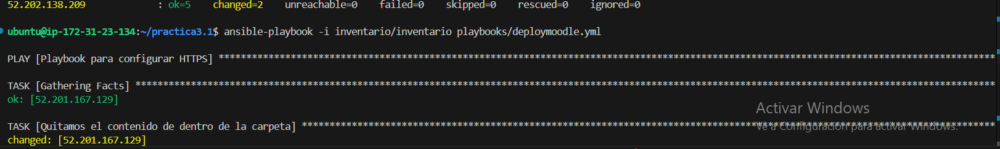
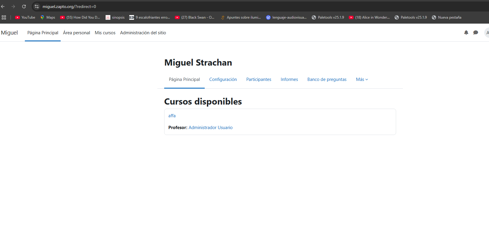
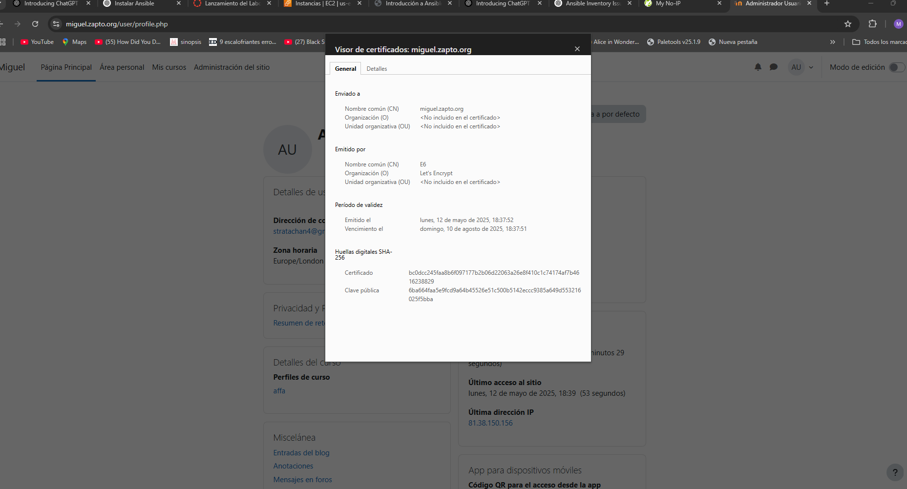

# practica3.1

En esta práctica,vamos a levar a cabo la implantación de la aplicación web Moodle en apache con ansible. Para ello necesitaremos varios playbooks y  distintos archivos que diremos a continuacion.
Tendremos un archivo de variable.yml con nuestras variables.
También,un htaccess , un archivo de inventario para guardar los grupos de ips de nuestras maquinas que utilizara el ansible para instalar cada playbooks donde corresponde y un 000-default.conf
 No olvidar que necesitaremos importarnos a nuestra máquina las claves ssh de lás máquinas que necesitaremos.en este caso,las del frontal y el backend.

 Ahora procedemos con la instalación.

## Instalación


### Backend
 Aqui instalaremos nuestra base de datos y un lamp para la backend.


#### Install lamp backend
```bash
--- 
- name: Configurar backend
  hosts: backend
  become: yes

  vars_files:
    - ../vars/variables.yml

  tasks:
    - name: Actualizamos los repositorios
      apt:
        update_cache: yes

    - name: Instalamos mysql-server
      apt:
        name: mysql-server
        state: present

    - name: Instalamos el modulo de python para mysql-server
      apt:
        name: python3-pymysql
        state: present

    - name: Configuramos el /etc/mysql
      replace:
        path: /etc/mysql/mysql.conf.d/mysqld.cnf
        regexp: 127.0.0.1
        replace: 0.0.0.0

    - name: Reseteamos mysql-server
      service:
        name: mysql
        state: restarted

```
#### Deploy de backend

```bash
--- 
- name: Playbook para configurar HTTPS
  hosts: backend
  become: yes

  vars_files:
    - ../vars/variables.yml

  tasks:
    - name: Quitamos la base de datos
      mysql_db:
        name: "{{ moodle.db.name }}"
        state: absent
        login_user: root
        login_unix_socket: /var/run/mysqld/mysqld.sock

    - name: Creamos la base de datos
      mysql_db:
        name: "{{ moodle.db.name }}"
        state: present
        login_user: root
        login_unix_socket: /var/run/mysqld/mysqld.sock

    - name: Quitamos el usuario si esiste
      mysql_user:
        name: "{{ moodle.db.user }}"
        host: "{{ frontend_ip }}"
        state: absent
        login_user: root
        login_unix_socket: /var/run/mysqld/mysqld.sock

    - name: Creamos el usuario
      mysql_user:
        name: "{{ moodle.db.user }}"
        password: "{{ moodle.db.password }}"
        host: "{{ frontend_ip }}"
        priv: "{{ moodle.db.name }}.*:ALL"
        state: present
        login_user: root
        login_unix_socket: /var/run/mysqld/mysqld.sock
```

Ahora,pasamos al fonted.Donde  instalaremos el moodle , el certificado y un lamp

## Fonted

Primero instalamos la lamp
```bash
--- 
- name: Configurar frontend lamp
  hosts: frontend
  become: yes

  vars_files:
    - ../vars/variables.yml

  tasks:
    - name: Actualizamos los repositorios
      apt:
        update_cache: yes

    - name: Actualizamos el ubuntu
      apt:
        upgrade: yes

    - name: Instalamos apache2 
      apt:
        name: apache2
        state: present
    - name:
      apache2_module:
        name: rewrite
        state: present

    - name: Copiamos el 000-default dentro de apache2
      copy:
        src:  ../templates/000-default.conf
        dest: /etc/apache2/sites-available

    - name: Instalamos los modulos de php
      apt:
        name:
          - php 
          - libapache2-mod-php 
          - php-mysql 
          - php-cli 
          - php-xml 
          - php-curl 
          - php-soap 
          - php-gd 
          - php-intl 
          - php-mbstring 
          - php-zip 
          - unzip
        state: present
        
    - name:
      service:
        name: apache2
        state: restarted

    - name:
      file:
        path: /var/www/html
        mode: 755
        owner: www-data
        group: www-data
        recurse: yes
        
    - name: Borramos la carpeta moodledata si existe
      file:
        path: /var/moodledata
        state: absent

    - name: "Creamos la carpeta moodledata"
      file:
        path: /var/moodledata
        state: directory
        mode: 0777
        owner: www-data
        group: www-data

```
Ahora el certificado

```bash
--- 
- name: Configurar certificado
  hosts: frontend
  become: yes

  vars_files:
    - ../vars/variables.yml

  tasks:
    - name: Desinstalar instalaciones previas de Certbot
      apt:
        name: certbot
        state: absent

    - name: Instalar Certbot con snap
      snap:
        name: certbot
        classic: yes
        state: present

    - name: Solicitamos el certificado
      command:
        certbot --apache \
        -m {{ certbot.email }} \
        --agree-tos \
        --no-eff-email \
        --non-interactive \
        -d {{ certbot.domain }}
```
Por último el moodle
```bash
--- 
- name: Moodle instalacion
  hosts: frontend
  become: yes

  vars_files:
    - ../vars/variables.yml

  tasks:
    - name: Quitamos el contenido de dentro de la carpeta
      command: rm -rf /var/www/html/*

    - name: Instalamos los paquetes necesarios
      apt:
        name:
          - wget
          - unzip
          - php
        state: present
    
    - name: Descargamos el repositorio de moodle
      get_url:
        url: "https://github.com/moodle/moodle/archive/refs/tags/v4.3.1.zip"
        dest: "/var/www/html/v4.3.1.zip"

    - name: instalamos el unzip
      apt:
        name: unzip
        state: present

    - name: Extraemos los archivos de moodle
      unarchive:
        src: "/var/www/html/v4.3.1.zip"
        dest: "/var/www/"
        remote_src: yes

    - name: movemos el contenido a la carpeta de html
      copy:
        src: /var/www/moodle-4.3.1/
        dest: /var/www/html/
        remote_src: yes
        mode: 775

    - name: Ponemos permisos a la carpeta html
      file:
        path: /var/www/html/
        owner: root
        group: root
        mode: '0755'
        recurse: yes
    
    - name: Aplicamos los permisos a la carpeta moodledata
      file:
        path: /var/moodledata
        owner: www-data
        group: www-data
        mode: '0755'
        recurse: yes

    - name: Copiamos nuestro htaccess a la carpeta de moodledata
      copy:
        src: "../htaccess/.htaccess"
        dest: "/var/moodledata/.htaccess"

    - name: Modificamos los maximos de inputs
      replace:
        path: /etc/php/8.3/cli/php.ini
        regexp: ";max_input_vars = 1000"
        replace: "max_input_vars = 5000"
        
    - name: Instalamos moodle por via CLI
      command: >
        php /var/www/html/admin/cli/install.php
        --wwwroot="https://{{ certbot.domain }}"
        --dataroot={{ moodle.data }}
        --dbname={{ moodle.db.name }}
        --dbuser={{ moodle.db.user }}
        --dbpass={{ moodle.db.password }}
        --dbhost={{ backend_ip }}
        --fullname="{{ moodle.FullName }}"
        --shortname={{ moodle.ShortName }}
        --adminuser={{ moodle.Admin.user }}
        --adminpass={{ moodle.Admin.pass }}
        --non-interactive
        --agree-license
        --lang=es
        --adminemail={{ moodle.Admin.Email }}
        --summary="{{ moodle.summary }}"
        --dbtype={{ moodle.db.type }}

    - name: le damos permisos a la carpeta html de nuevo
      file:
        path: /var/www/html/
        mode: '0755'
        recurse: yes

    - name: Reiniciamos apache
      systemd:
        name: apache2
        state: restarted
```
## Comprobaciones
Como tirar en ansible un script


Comprobación de nuestro moodle


Verificación de nuestro certificado
